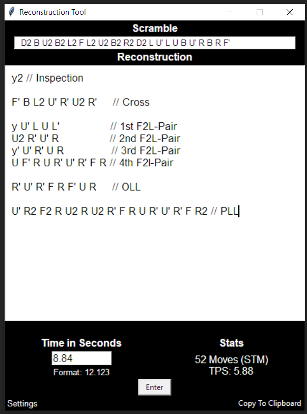
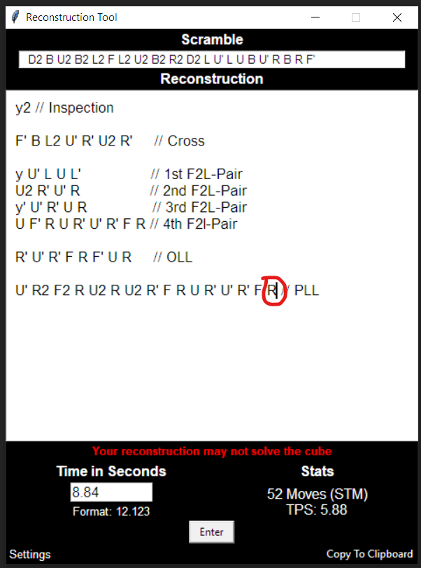
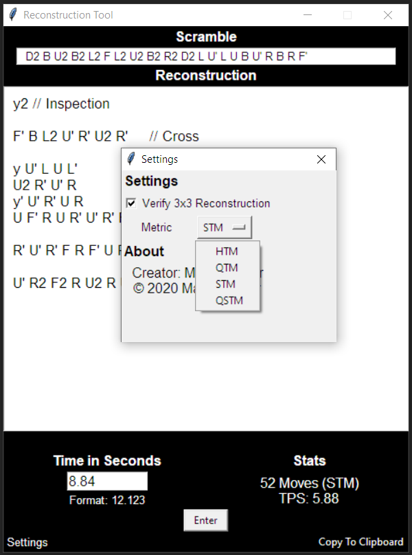

First download and unpack the ReconstructionTool.zip file.
Then look for "ReconstructionTool.exe" (quite far down) and create a Shortcut.
Place the shortcut wherever you want or need it.
Clicking on the shortcut should open my program.

Now comes the boring part where I will try
to explain my program as best as I can.

First you copy your 3x3 scramble from your timer of choice into the 
scramble text field via rightclick and paste, Ctrl-V or you type it out.
You can press "Return" or "Tab" to focus on the reconstruction text field and 
write down your reconstruction.

It takes all the rotations x y z, x' y' z', x2 y2 z2, 
standart moves R L U D F B, the inverse R' L' U' D' F' B'
and of course double moves R2 L2 U2 D2 F2 B2.
Additionally you can write R2' L2' and so on as well as wide moves such as
Rw or r and slice moves M E S.

You can add comments in the reconstruction but you must not use any moves or
rotations mentioned above because it will count them as a move or rotation
which later affects the number of moves and the TPS.

"Shift+Return" or "Tab" will now focus on the time text field. Input your time
and hit "Return" to let the program count all the moves and calculate the TPS.

If you happen to make a mistake in your reconstruction the program will
let you know. This only works for 3x3!

You want to share your reconstruction? Great, click on "Copy To Clipboard" and
the program will format everything like shown in the example below and you
can send it to your friend.

This will be in your clipboard:

	8.84 Single D2 B U2 B2 L2 F L2 U2 B2 R2 D2 L U' L U B U' R B R F'

	Reconstruction:
	y2 // Inspection

	F' B L2 U' R' U2 R' // Cross

	y U' L U L' // 1st F2L-Pair
	U2 R' U' R // 2nd F2L-Pair
	y' U' R' U R // 3rd F2L-Pair
	U F' R U R' U' R' F R // 4th F2l-Pair

	R' U' R' F R F' U R // OLL

	U' R2 F2 R U2 R U2 R' F R U R' U' R' F R2 // PLL

	52 Moves
	TPS: 5.88

Aditionally you can change whether you want to verify the reconstruction
and what metric you want the program to use to calculate the moves and TPS.

The program as the .exe format only works on Windows. I'm not sure if the
Python code works on macOS or Linux. Just try it out and let me know.
